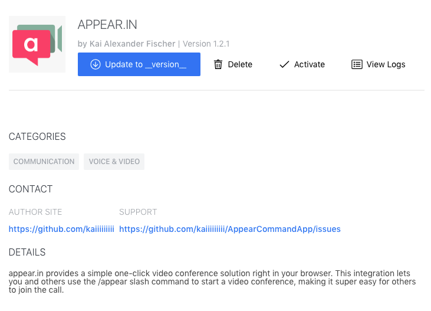
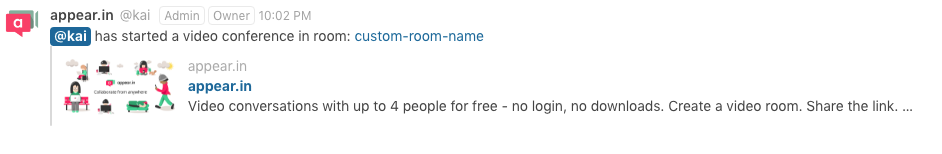

# Rocket.Chat.App-appear.in

appear.in provides a simple one-click video conference solution right in your browser. This integration lets you and others use the /appear slash command to start a video conference, making it super easy for others to join the call.

### Commands

Basicly there's just one command.

	/appear [custom room name]

*A random room name will be used if non is provided.*

### Links

- [Appear.in](https://appear.in/)
- [Rocket.Chat](https://rocket.chat/)
- [Rocket.Chat.Apps-cli](https://github.com/RocketChat/Rocket.Chat.Apps-cli/)
